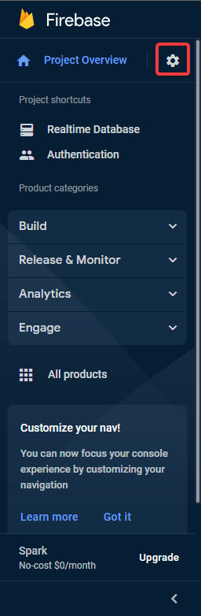

## Creating Firebase project

To start click on "Create a project".

And fill out all the required information.

## Adding database to the project

Once the project ready click "Continue" and go to the left hand side sidemenu and select "All products".  

In the list find and select "Realtime Database". Next click "Create Database"  

Select data base location and select "Start in locked mode" for security rules.  

## Get access key and configure database access

Next got to project settings by clicking the cogwheel in the sidemenu and select "Project settings"  

Now go to "Sevice accounts" tab and select "Firebase Admin SDK"  

Scroll down and click "Generate new private key"   

Move the downloaded key to your application folder, you may also rename the file for easier usage

> To use the generated keys with this projects python client move the file into the `firebase/python/src/config` folder and rename the file to `firebase-admin-cert.json`
